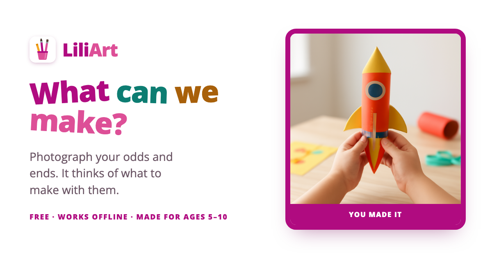
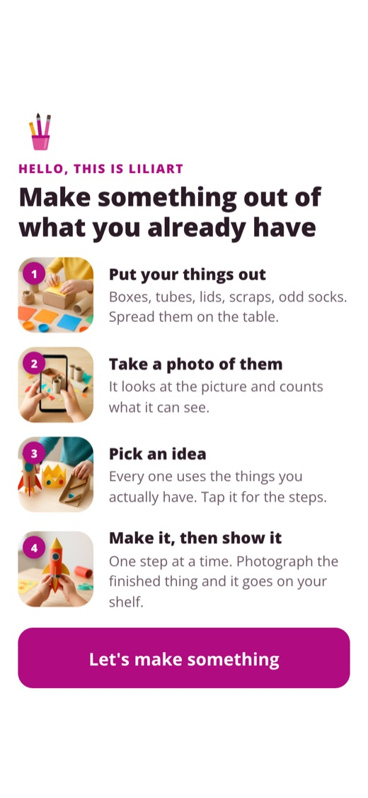
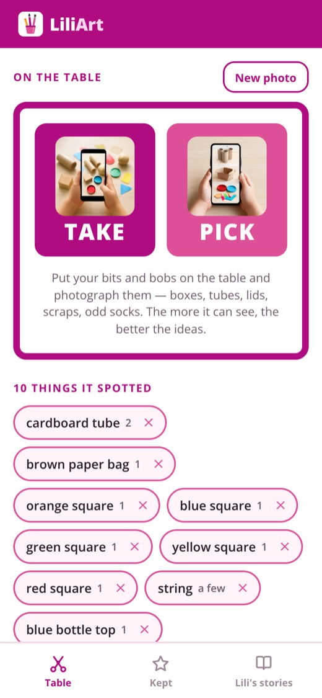
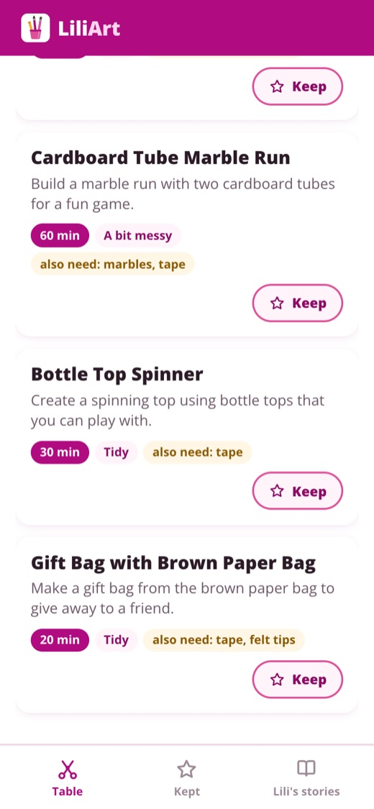
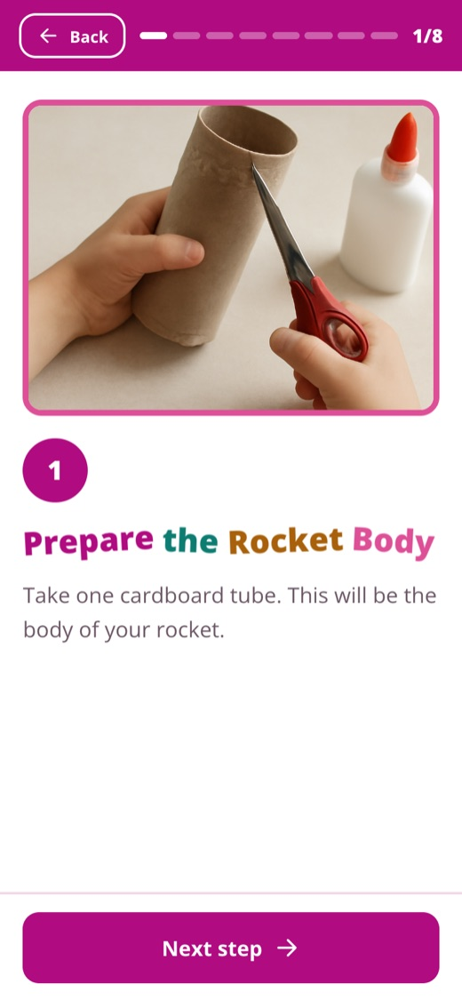

# LiliArt

Photograph the odds and ends you already have (boxes, tubes, lids, scraps, odd
socks) and LiliArt suggests things a child could make with them, then walks
through one of them step by step. It is a web app for children of about five to
ten and the grown-up sitting next to them.

**Try it: [liliart.victorsaly.com](https://liliart.victorsaly.com)** (free, no
account, installable as an app)



## What it offers

<p>
  
  
  
  
</p>

- **Photo in, materials out.** Take a photo with the camera or pick one from the
  device. It lists what it can see, with rough amounts, as stickers you can
  remove if it got something wrong.
- **Ideas that use what you have.** A handful of crafts, each with a time, how
  messy it is, and anything extra you would need (tape, felt tips). Change the
  list and it offers to think again.
- **A full write-up for each idea.** Tools and what each is for, numbered
  steps, and a drawing of roughly how the finished thing might look.
- **Make mode.** One step per screen in big type, with a picture of that step
  being done, a progress bar, and the screen kept awake while you work. Steps
  that need scissors, a glue gun or anything hot or sharp are marked
  **A grown-up does this bit**.
- **Kept.** Slide an idea right to keep it, left to hide it. Kept crafts are
  stored on the device and open with no internet. Photograph what you made at
  the end and it goes on your shelf.
- **Installable and offline-aware.** It is a PWA with a service worker. Without
  a connection it says so, and still opens everything already kept.
- A link to [Lili's stories](https://victorsaly.github.io/LilianaBlog/), the
  companion story site.

## Safety rules

Every request to the model starts with the same house rules (`SAFETY` in
`worker/src/index.js`): the audience is a child of about seven with a parent
nearby, so nothing needing an oven, hob, naked flame, bleach, solvents or power
tools; any step with scissors, a hot glue gun or anything sharp or hot is
flagged for a grown-up; short, plain sentences and no brand names.

## How it works

The browser never holds an API key. The front end, a static React app on GitHub
Pages, calls `liliart-api`, a small Cloudflare Worker that holds the OpenAI key
and exposes four endpoints:

| Endpoint | In | Out |
| --- | --- | --- |
| `POST /v1/ai/materials` | a photo, shrunk to 768px first | the materials in it |
| `POST /v1/ai/ideas` | the materials | a few things to make |
| `POST /v1/ai/craft` | one idea | tools, steps, time, mess |
| `POST /v1/ai/picture` | a craft or one step | an illustration |

Text comes from `gpt-4o-mini` and pictures from `gpt-image-1-mini`. The worker
limits CORS to the site's own origins and meters use per address per day in a
D1 table, so finding the endpoint does not mean running up the bill.

The table photo is sent to the worker to be read. Kept crafts and photos of
finished makes stay in the browser's local storage.

## Tech stack

React 19, TypeScript, Vite, a hand-written service worker, Cloudflare Workers
and D1, OpenAI. Deployed to GitHub Pages by `.github/workflows/deploy.yml` on
every push to `main`.

## Run locally

```bash
npm install
npm run dev       # http://localhost:5173
npm run build     # type-check, build, then write dist/sw.js
npm run lint
```

The dev server talks to the deployed worker by default. To use another, set
`VITE_LILIART_API` in `.env`.

To deploy your own worker:

```bash
cd worker
npx wrangler secret put OPENAI_API_KEY
npx wrangler deploy
```

It needs a D1 database bound as `DB` (see `worker/wrangler.toml`) and your
front end's origin in `ALLOWED_ORIGINS`. The usage table is created on first
request.

## Project structure

```
src/
  App.tsx            Table and Kept tabs, plus the craft and make screens
  components/        PhotoStep, Camera, Materials, Ideas, CraftSheet,
                     MakeScreen, Kept, HowItWorks, Swipe, ...
  lib/ai.ts          calls to the worker and friendly error messages
  lib/photo.ts       resizes photos before upload
  lib/saved.ts       kept crafts in local storage
  styles/make.css    all the styling
public/              icons, manifest, social card, how-it-works photos
scripts/             builds the service worker with the list of files to cache
worker/              the Cloudflare Worker (liliart-api)
```

Made by [Victor Saly](https://victorsaly.com).
